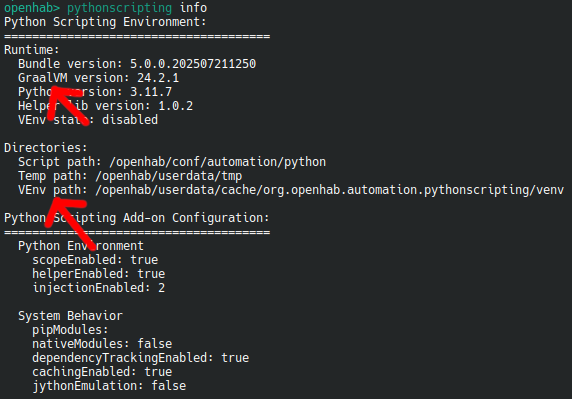

# Python Scripting

This add-on provides support for Python 3 that can be used as a scripting language within automation rules.
It is based on [GraalPy](https://www.graalvm.org/python/) from the [GraalVM project](https://www.graalvm.org/).

Also included is [openhab-python](https://github.com/openhab/openhab-python), a Python library to support automation in openHAB.
It provides convenient access to common core openHAB functions that make the full range of Java APIs easily accessible and usable.

[[toc]]

## Creating Python Scripts

When this add-on is installed, you can select Python 3 as a scripting language when creating a script action within the rule editor of the UI.

Alternatively, you can create scripts in the `automation/python` configuration directory.
If you create an empty file called `test.py`, you will see a log line with information similar to:

```text
... [INFO ] [ort.loader.AbstractScriptFileWatcher] - (Re-)Loading script '/openhab/conf/automation/python/test.py'
```

To enable debug logging, use the [console logging](https://openhab.org/docs/administration/logging.html) commands to
enable debug logging for the automation functionality:

```text
log:set DEBUG org.openhab.automation.pythonscripting
```

### Rules

Lets start with a simple rule

```python
from openhab import rule
from openhab.triggers import GenericCronTrigger

@rule( triggers = [ GenericCronTrigger("*/5 * * * * ?") ] )
class Test:
    def execute(self, module, input):
        self.logger.info("Rule was triggered")
```

### `PY` Transformation

Or as transformation inline script

```text
String Test "Test [PY(|'String has ' + str(len(input)) + 'characters'):%s]"
```

### More Scripting

A complete Documentation about Python Scripting Rules and Transformation Scripts can be found at

[openHAB Python Scripting](https://github.com/openhab/openhab-python/blob/main/README.md)

including all examples above, much more detailed.

## Add-on Administration

### Configuration

Check via Web UI => Settings / Add-on Settings / Python Scripting

### Console

The [openHAB Console](https://www.openhab.org/docs/administration/console.html) provides access to additional features of these Add-on.

1. `pythonscripting info` is showing you additional data like version numbers, activated features and used path locations
2. `pythonscripting console` provides an interactive python console where you can try live python features
3. `pythonscripting update` allowes you to check, list, update or downgrade your helper lib
4. `pythonscripting pip` allowes you check, install or remove external python modules<br/>These feature is only available if [VEnv is enabled](#enabling-venv)

### Enabling VEnv

VEnv based python runtimes are optional, but needed to provide support for additional modules via 'pip' and for native modules. To activate this feature, simply follow the steps below.

1. Login into [openHAB console](https://www.openhab.org/docs/administration/console.html) and check your current pythonscripting environment by calling 'pythonscripting info'<br/><br/>Important values are:



- `GraalVM version: 24.2.1`
- `VEnv path: /openhab/userdata/cache/org.openhab.automation.pythonscripting/venv`<br/><br/>These values are needed during the next step.

2. Download graalpy-community and create venv

```shell
# The downloaded graalpy-community tar.gz must match your operating system (linux, windows or macos), your architecture (amd64, aarch64) and your "GraalVM version" of openHAB
wget -qO- https://github.com/oracle/graalpython/releases/download/graal-24.2.1/graalpy-community-24.2.1-linux-amd64.tar.gz | gunzip | tar xvf -
cd graalpy-community-24.2.1-linux-amd64/

# The venv target dir must match your "VEnv path" of openHAB
./bin/graalpy -m venv /openhab/userdata/cache/org.openhab.automation.pythonscripting/venv
```

3. Install 'patchelf' which is needed for native module support in graalpy (optional).

```
apt-get install patchelf
# zypper install patchelf
# yum install patchelf
```

After these steps, venv setup is done and will be detected automatically during next openHAB restart.

::: tip VEnv note
Theoretically you can create venvs with a native python installation too. But it is strongly recommended to use graalpy for it. It will install a "special" version of pip in this venv, which will install patched python modules if available. This increases the compatibility of python modules with graalpython.

In container environments, you should mount the 'graalpy' folder to, because the venv is using symbolik links.
:::

## Typical log errors

### Exception during helper lib initialisation

There were problems during the deployment of the helper libs.
A typical error is an insufficient permission.
The folder "conf/automation/python/" must be writeable by openHAB.

### Failed to inject import wrapper

The reading the Python source file "conf/automation/python/lib/openhab/\_\_wrapper\_\_.py" failed.

This could either a permission/owner problem or a problem during deployment of the helper libs.
You should check that this file exists and it is readable by openHAB.
You should also check your logs for a message related to the helper lib deployment by just grep for "helper lib".

### Can't installing pip modules. VEnv not enabled.

Your VEnv setup is not initialized or detected. Please confirm the correct setup, by following the steps about [Enabling VEnv](#enabling-venv)

### User timezone 'XYZ' is different than openhab regional timezone

This means that your configuration EXTRA_JAVA_OPTS="-Duser.timezone=XYZ" is different then the one, configured in openHAB regional settings.

e.g. in openHABian this can be changed in /etc/default/openhab

or for containers, this can be provided as a additional environment variable.

## Limitations

- GraalPy can't handle arguments in constructors of Java objects. Means you can't instantiate a Java object in Python with a parameter. https://github.com/oracle/graalpython/issues/367
